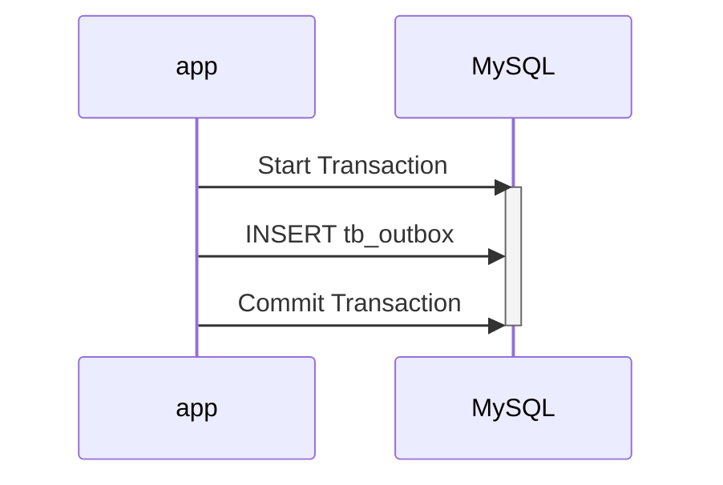
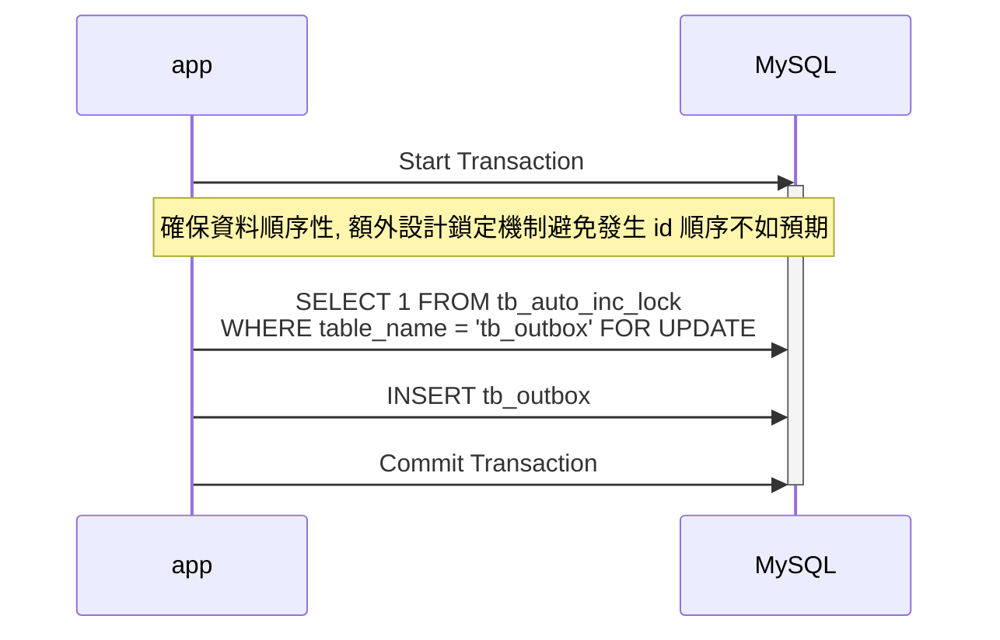

# BenchmarkOutboxPattern

## Sequence Diagram

### Insert Outbox


### Insert Outbox with Auto Increment Lock


## How to run ?
```bash
docker-compose up --wait --remove-orphans
go mod download
go test -v -bench=. -run=none .
```

## How to switch between MySQL 5.7 and MySQL 8.0 ?
```
# main_test.go
var (
	mysql57 = "root:example@tcp(127.0.0.1:33060)/db?charset=utf8mb4&parseTime=True&loc=Local"
	mysql80 = "root:example@tcp(127.0.0.1:33061)/db?charset=utf8mb4&parseTime=True&loc=Local"
	dns     = mysql57
)
```

## Results (MySQL 5.7.42)
```
goos: darwin
goarch: arm64
pkg: BenchmarkOutboxPattern
BenchmarkInsertOutbox
BenchmarkInsertOutbox-8                                     1069           1135916 ns/op
BenchmarkInsertOutboxWithParallel
BenchmarkInsertOutboxWithParallel-8                         1917            530694 ns/op
BenchmarkInsertOutboxWithOffsetLock
BenchmarkInsertOutboxWithOffsetLock-8                        643           1587850 ns/op
BenchmarkInsertOutboxWithOffsetLockWithParallel
BenchmarkInsertOutboxWithOffsetLockWithParallel-8           1275            961272 ns/op
PASS
ok      BenchmarkOutboxPattern  7.286s
```

## Results (MySQL 8.2.0)
```
goos: darwin
goarch: arm64
pkg: BenchmarkOutboxPattern
BenchmarkInsertOutbox
BenchmarkInsertOutbox-8                                      867           1371794 ns/op
BenchmarkInsertOutboxWithParallel
BenchmarkInsertOutboxWithParallel-8                         2911            417200 ns/op
BenchmarkInsertOutboxWithOffsetLock
BenchmarkInsertOutboxWithOffsetLock-8                        656           1756404 ns/op
BenchmarkInsertOutboxWithOffsetLockWithParallel
BenchmarkInsertOutboxWithOffsetLockWithParallel-8            895           1393506 ns/op
PASS
ok      BenchmarkOutboxPattern  7.939s
```
